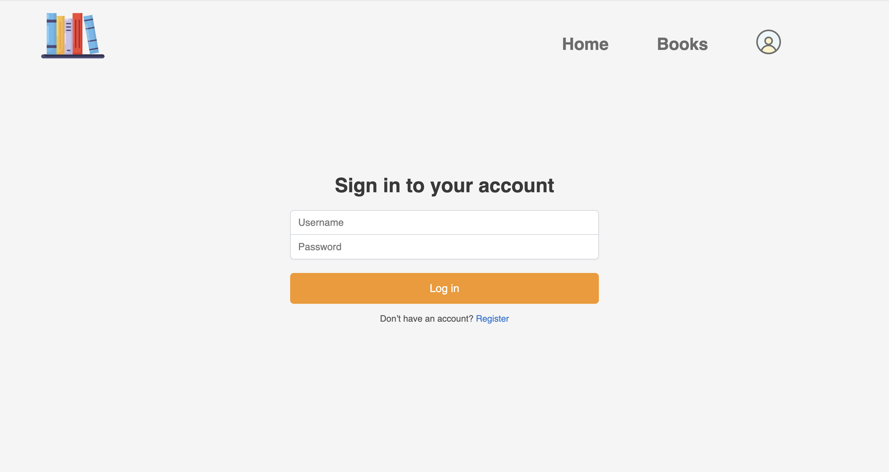
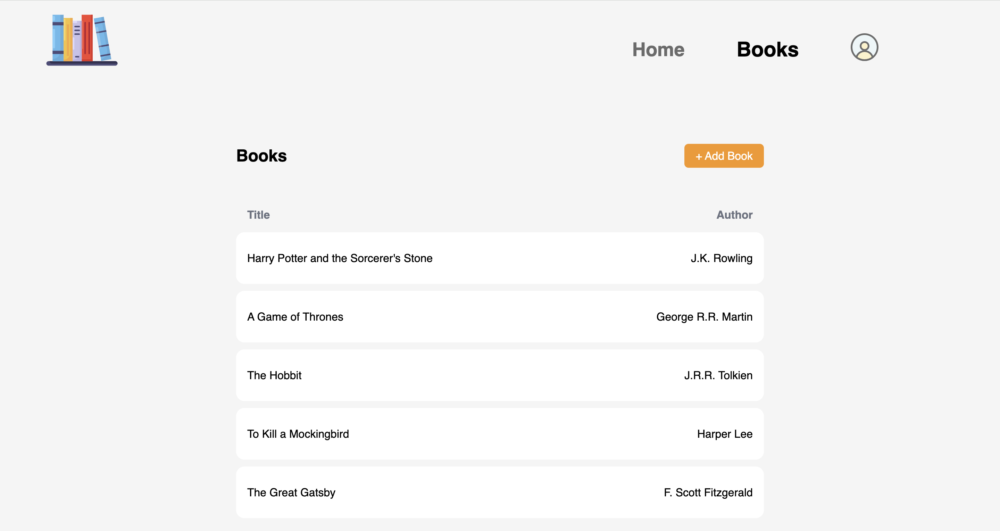
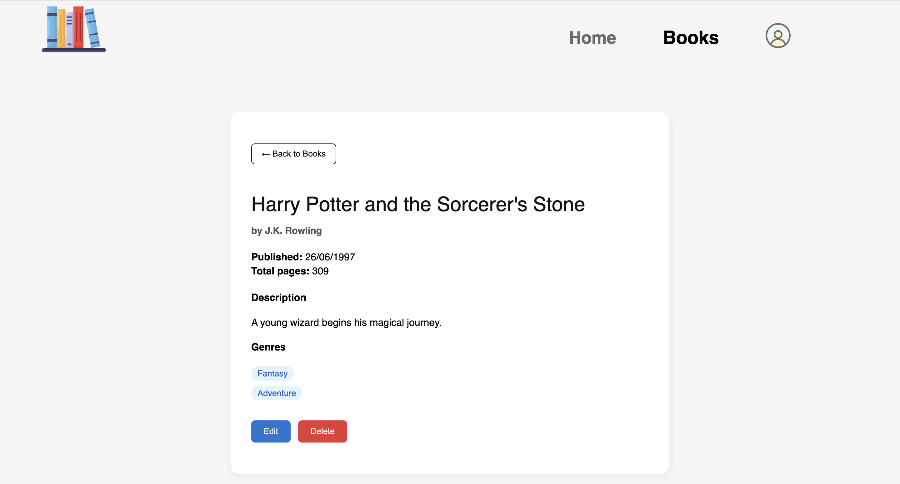
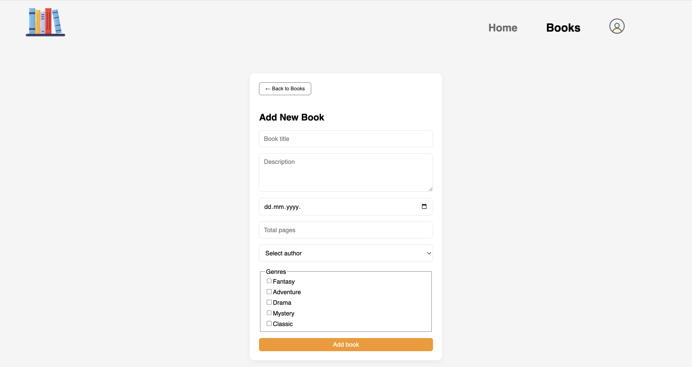
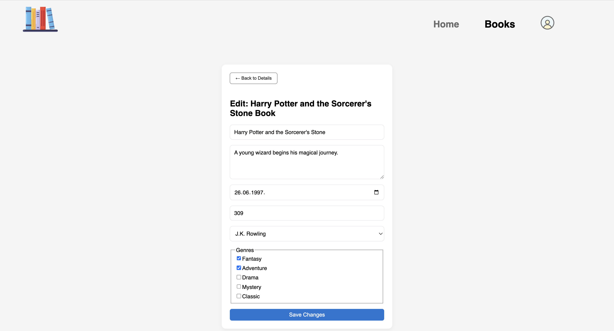
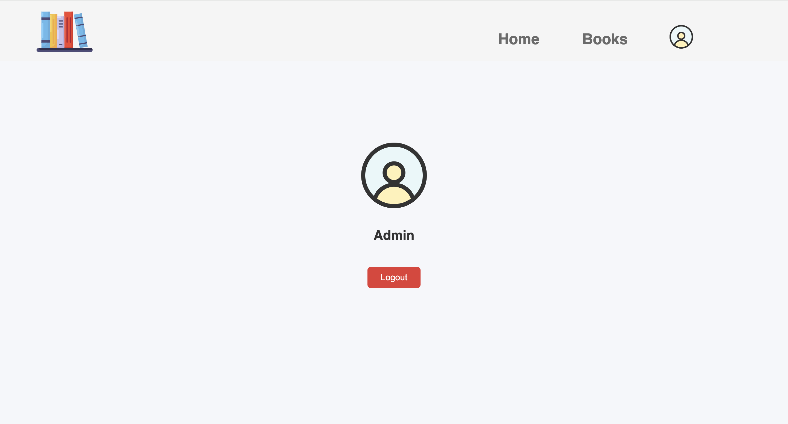

# Simple Book Library React UI

A React frontend for browsing and managing books, connected to a backend API ([SIMPLE BOOK WEB API](https://github.com/isoricstrize/SimpleBookWebApi.git)). Users can view books, while admins can add, edit or delete books.


## Features

- Browse a list of books with their authors.
- View detailed information for each book including description, published date, genres, and total pages.
- Admin features: add, edit, and delete books.
- User authentication (login).
- User registration.

## Technologies Used

- React 19
- React Router DOM 7
- JavaScript (ES6+)
- HTML5 & CSS3
- Vite 7

## Future Improvements

- Add search, filtering, sorting, and pagination for books.
- Allow admins to create new authors instead of only choosing from existing authors.
- Improve security by moving tokens from localStorage to HttpOnly cookies.
- Improve UI.
- Add unit and integration tests.

## Screenshots

<details>
<summary>Show more</summary>

**Login Page**


**Books List Page**


**Book Details Page**


**Add New Book Page**


**Edit Book Page**


**Profile Page**


</details>

## Setup

### Run Locally

```
git clone https://github.com/isoricstrize/simplebook-ui.git
cd simplebook-ui
npm install
npm run dev
```

**Note:** Make sure your backend API is running on http://localhost:5041 (or update API_URL in apiClient.js). Backend repository: [SIMPLE BOOK WEB API](https://github.com/isoricstrize/SimpleBookWebApi.git)

### Admin Credentials

Use these credentials to test admin features:

```
Username: Admin
Password: Admin123
```

**Note:** These credentials are for demo/testing only.
